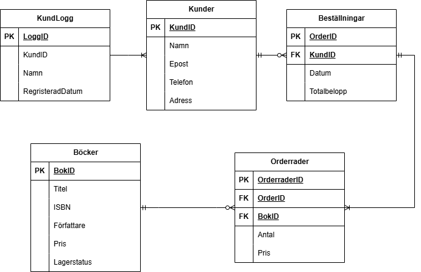

# 📚 Bokstugan – Databas för en liten bokhandel

*Inlämning 2 – Avancerad SQL & Databashantering (YH25)*

**Gabriel Gustafsson**

---

## 🟥 Syfte

Syftet med databasen är att modellera en liten bokhandel som kan hantera kunder, böcker och beställningar på ett strukturerat och effektivt sätt.

Databasen gör det möjligt att:

* registrera kunder och deras kontaktuppgifter
* lagra butikens sortiment av böcker
* hantera kundbeställningar och koppla dem till rätt kund
* se vilka böcker som ingår i varje beställning
* analysera data, t.ex. antal beställningar per kund

Denna inlämning bygger vidare på tidigare databas och fokuserar på avancerad SQL, triggers, index samt backup och återställning.

---

## 🟨 ER-diagram

Databasens struktur illustreras i följande ER-diagram:



**Relationer i modellen:**

* En kund kan finnas utan beställningar, men en beställning måste alltid kopplas till exakt en kund
* En beställning innehåller en eller flera orderrader
* En bok kan förekomma i flera orderrader

---

## 🟩 Tabeller

* **Kunder** – information om kunder (namn, e-post, telefon, adress)
* **Bocker** – boksortiment (titel, ISBN, pris, lagerstatus)
* **Bestallningar** – kunders beställningar
* **Orderrader** – vilka böcker som ingår i varje beställning
* **KundLogg** – loggar registrering av nya kunder

---

## 🟦 Funktioner som används

* Primärnycklar (PK) och `AUTO_INCREMENT`
* Främmande nycklar (FK)
* `UNIQUE`, `NOT NULL`, `CHECK`
* `DEFAULT CURRENT_TIMESTAMP`
* `INSERT`, `SELECT`
* `INNER JOIN`, `LEFT JOIN`
* `GROUP BY`, `HAVING`

---

## ⚙️ Avancerad funktionalitet

### Modifiering av data

* `UPDATE` används för att ändra kunders e-post
* `DELETE` används för att ta bort kunder
* `TRANSACTION` och `ROLLBACK` används för att visa hur ändringar kan ångras

### JOINs och analys

* `INNER JOIN` – visar kunder som gjort beställningar
* `LEFT JOIN` – visar alla kunder, även utan beställningar
* `GROUP BY` – räknar antal beställningar per kund
* `HAVING` – filtrerar kunder med fler än 2 beställningar

### Triggers

* Loggar när en ny kund registreras
* Minskar lagersaldo när en orderrad skapas

---

## 💾 Backup & Restore

Backup och återställning har genomförts med MySQL Workbench.

### Skapa backup:
- Server → Data Export  
- Välj databasen *Bokstugan*  
- Kryssar i *Dump Stored Procedures and Functions och Triggers*
- Exportera som Self-contained file (bokhandel_backup.sql)

### Återställa databasen:
- Skapa en ny databas med namn *bokstugan_backup*
- Server → Data Import  
- Välj backup-filen
- Välj den nya databasen som default target schema
- Importera till databasen *Bokstugan*

### Verifiering:
Efter återställning kördes SELECT-frågor för att kontrollera att all data fanns kvar:
```sql
SELECT * FROM Kunder;
SELECT * FROM Bocker;
SELECT * FROM Bestallningar;
```

---

## 🔍 Reflektion

### Databasdesign

Databasen är normaliserad för att undvika duplicerad data och säkerställa dataintegritet.
Relationerna gör det möjligt att hantera kunder, beställningar och produkter effektivt.

Triggers används för att automatisera loggning och lagerhantering, vilket minskar risken för manuella fel.

---

### Förbättringar

Triggern för lagerhantering minskar lagersaldo automatiskt, men den kontrollerar inte om det finns tillräckligt många produkter i lager. Detta kan leda till negativa lagersaldon.

En förbättring hade då varit att inte göra det möjligt för lagersaldot att understiga negativt.

Detta är särskilt viktigt i system med många samtidiga användare där flera beställningar kan påverka lagret samtidigt.

En annan förbättring är att totalbelopp i Bestallningar lagras manuellt, vilket kan leda till inkonsistens. En bättre lösning hade varit att beräkna summan från Orderrader.

---

### Prestanda

Index förbättrar sökningar och JOINs, medan constraints och triggers säkerställer datakvalitet och minskar risken för fel.

---

## 🟪 Lärdomar

En viktig lärdom var valet av datatyp för ISBN.
`INT` var för liten, `VARCHAR` tillät felaktiga värden, och därför valdes `BIGINT` som korrekt lösning.

En annan insikt var att databasen måste spegla verkligheten, inte bara testdata.
En kund kan finnas utan att ha gjort en beställning, vilket påverkade hur relationerna modellerades.

---

## 📁 Filer i projektet

* README.md
* inlamning2.sql
* bokhandel_backup.sql
* images/er-diagram.png

---
